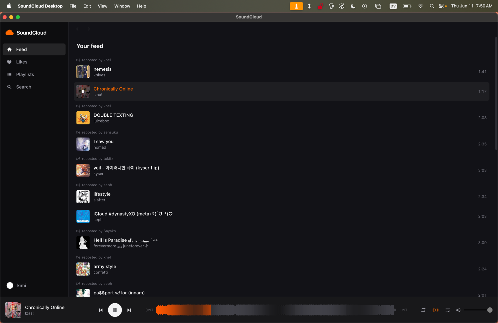
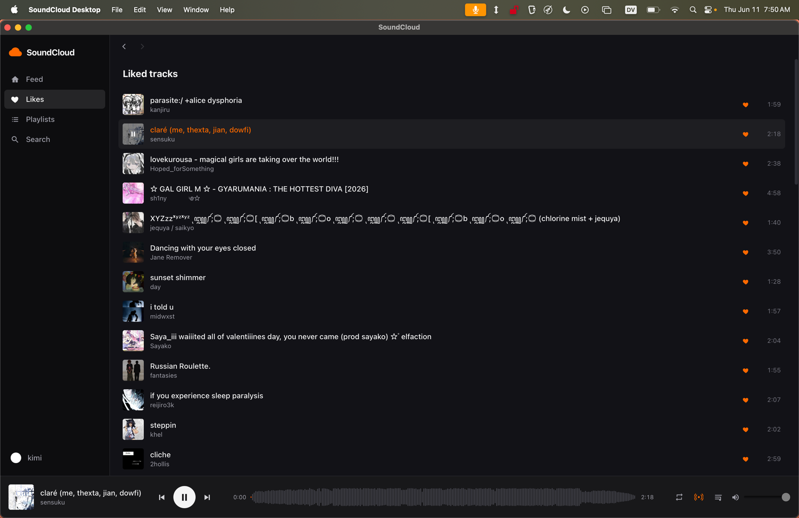
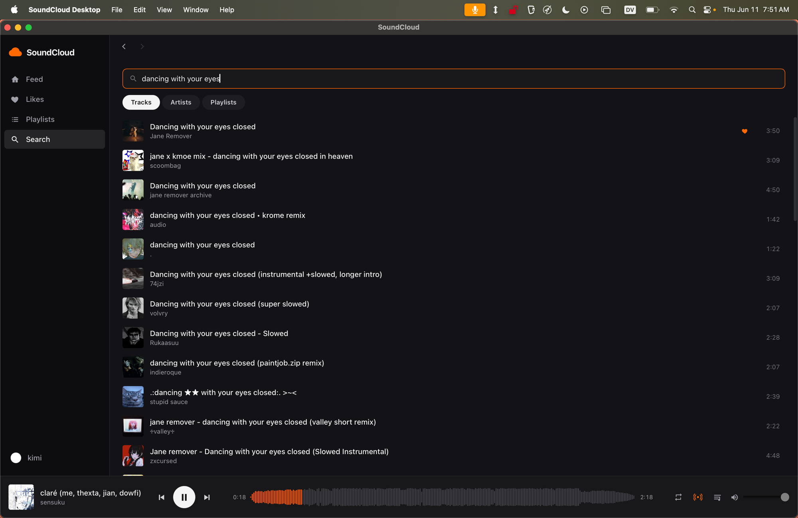
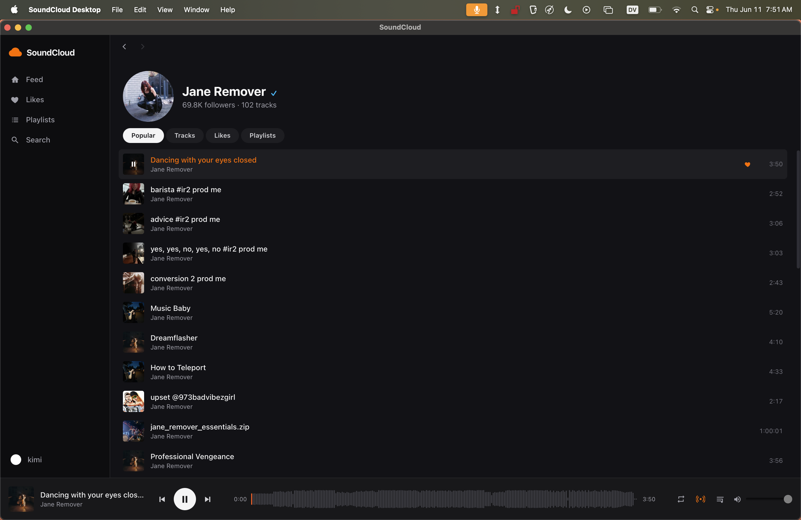

# SoundCloud Desktop

A personal SoundCloud client for macOS. Tauri 2 + Rust backend, React frontend.
Custom UI over SoundCloud's internal `api-v2` (the same API their web app uses),
authenticated with your own browser OAuth token.

## Screenshots

| Feed | Likes |
| --- | --- |
|  |  |

| Search | Artist page |
| --- | --- |
|  |  |

## Features

- **Home feed** — tracks and reposts from artists you follow, infinite scroll
- **Likes & playlists** — browse/play your library; like/unlike; add/remove playlist tracks
- **Search & artist pages** — tracks / artists / playlists, with popular & likes tabs
- **Station autoplay** — when the queue runs out, related tracks keep playing (toggleable)
- **Offline downloads** — cache tracks locally (HLS → ffmpeg remux to .m4a), LRU cache with size cap, plays offline
- **Real player** — queue management, canvas waveform seeking, media keys, macOS Now Playing / Control Center integration
- **Discord Rich Presence** — "Listening to SoundCloud" with track, artist, artwork, and a live progress bar (Spotify-style); hides while paused, toggleable in Settings
- Go+-only tracks play their 30s preview (free account); geo-blocked tracks are skipped

## Setup

```sh
pnpm install
pnpm tauri dev      # development
pnpm tauri build    # produces the .app under src-tauri/target/release/bundle/macOS/
```

Requirements: Rust, Node + pnpm, and optionally `ffmpeg` (Homebrew) for offline
downloads (without it, downloads are stored as raw fMP4, which usually still plays).

## Connecting your account

The app needs your SoundCloud OAuth token (one-time paste, stored in the macOS Keychain):

1. Open **soundcloud.com** in your browser, logged in.
2. DevTools (`⌘⌥I`) → **Storage** tab (Firefox) / **Application** tab (Chrome) → **Cookies** → `https://soundcloud.com`.
3. Copy the value of the `oauth_token` cookie (starts with `2-`).
4. Paste it into the app's connect screen.

Tokens occasionally expire — the app shows a banner and you paste a fresh one in Settings.

## How it works / maintenance notes

This is an unofficial client; SoundCloud can change the internal API at any time.
Known moving parts, and where they're handled:

- **client_id** is scraped from soundcloud.com's JS bundles
  (`src-tauri/src/sc/client_id.rs`) and auto-refreshed on any 401/403.
- **Stream URLs** must be resolved per-play: each transcoding resolve requires the
  track's `track_authorization` JWT, and the returned CDN URL is signed and expires
  (observed ~2h in mid-2026; historically as little as 5 min). The player
  re-resolves and seek-restores automatically on failure
  (`src/player/audioController.ts`).
- Some transcodings (e.g. `abr_sq`) return 404 on free accounts — the resolver
  falls through candidates by quality (`src-tauri/src/media/resolver.rs`).
- **Write-op endpoint shapes** (`PUT /users/{me}/track_likes/{id}`,
  `PUT /playlists/{id}` with a full track-id array) follow the web app's known
  patterns but were not verified against a live account at build time. If a write
  fails, capture the exact request on soundcloud.com via DevTools → Network and
  adjust `src-tauri/src/sc/endpoints.rs`.
- **Rate limiting**: a global ~800ms gap between api-v2 calls; 429s honor
  Retry-After with backoff.

Downloads live in `~/Library/Application Support/com.enyouki.soundcloud/`
(`audio/` + `cache.db`). Downloading streams is against SoundCloud's ToS — this
app is for personal use.

## Keyboard

- `Space` — play/pause
- `Shift+→` / `Shift+←` — next / previous
